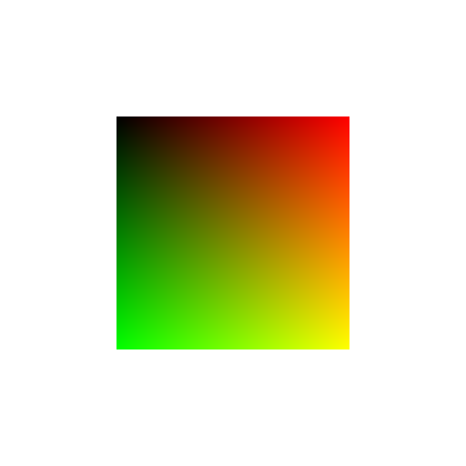
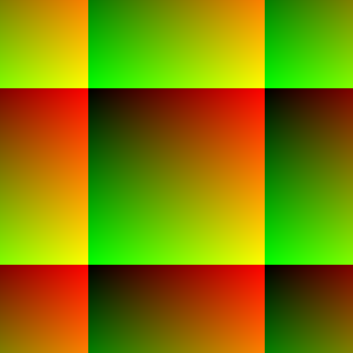
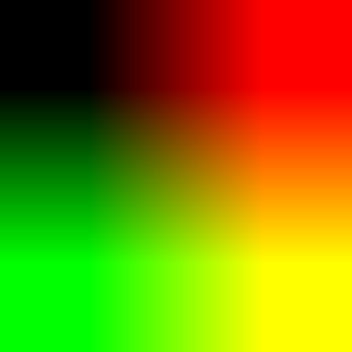
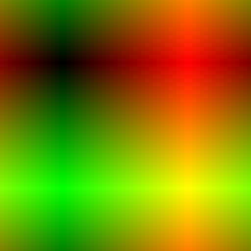

#### boundmode (boundary handling mode)

0. ignore: Values that exceed the limits are ignored.    
1. clear: Values that exceed the limits are set to 0.    
	
2. wrap: Values that exceed the limits are wrapped around to the opposite limit with a modulo operation. (256 wraps to 0, 257 wraps to 1, and -1 wraps to 255, -2 wraps to 254, etc.)    
	
	```
	if((x%=w)<0) x+=w;
	```
3. clip: Values are limited not to exceed min or max. (e.g. numbers greater than 255 are set to 255, and numbers less than 0 are set to 0.)    
	
4. ~~fold: Values that exceed the limits are folded back in the opposite direction. (256 is folded back to 254, 257 is folded back to 253, and -1 is folded back to 1, -2 to 2, etc.)~~    
	fold: Values that exceed the limits are folded back in the opposite direction. (256 is folded back to 255, 257 is folded back to 254, and -1 is folded back to 0, -2 to 1, etc.)    
	
	```
	if((x%=(w<<1))<0) x=-(++x);
	if(x>w-1) x=(w<<1)-(++x);
	```
5. fold: Values that exceed the limits are folded back in the opposite direction. (256 is folded back to 254, 257 is folded back to 253, and -1 is folded back to 1, -2 to 2, etc.)    
	
	```
	if(x<0) x=-x;
	if(x>w-1) {
		x%=(w-1)<<1;
		if(x>w-1) x=((w-1)<<1)-x;
	}
	```
##### Reference
[Jitter](https://cycling74.com/products/jitter)
